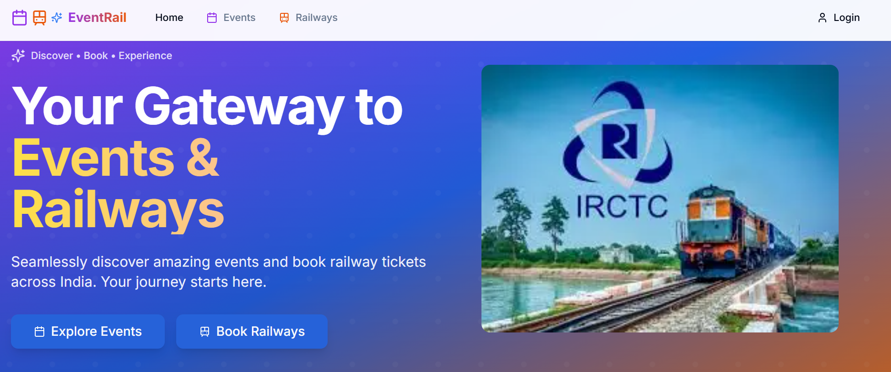
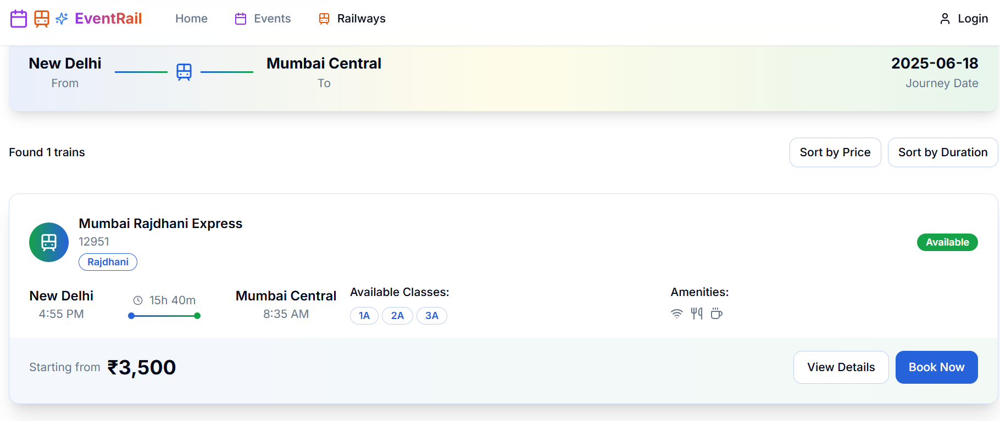
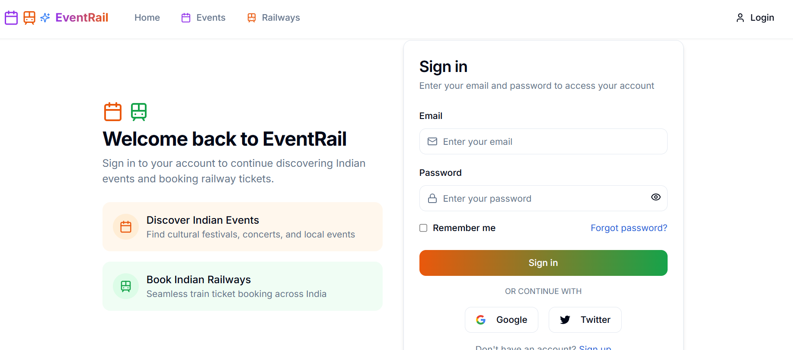

# 🚆 EventRail Platform

A modern full-stack web platform for discovering events and booking railway tickets across India.

---

## ✨ Features

- 🎫 **Event Discovery**: Browse cultural events, concerts, festivals, and tech conferences
- 🚄 **Railway Booking**: Search and book train tickets with real-time seat availability
- 🔐 **User Authentication**: Secure registration and login system using JWT
- 🌓 **Responsive & Dark Mode**: Works beautifully across devices with light/dark theme toggle
- 💳 **Secure Payments**: Stripe integration for booking payments
- 📩 **Email Notifications**: Get updates via SMTP-based emails

---

## 🛠️ Tech Stack

| Layer         | Tech Used                          |
|---------------|------------------------------------|
| Frontend      | Next.js 14, React, TypeScript      |
| Styling       | Tailwind CSS, ShadCN UI            |
| Backend       | Node.js, Express                   |
| Database      | MongoDB with Mongoose              |
| Auth          | Custom JWT-based authentication    |
| Email         | Nodemailer (SMTP)                  |
| Payments      | Stripe API                         |

---

## 📸 Project Structure (Tree View)

> _The above screenshot visually represents the folder structure and layout of the project._

---

## ⚙️ Getting Started

### ✅ Prerequisites

- Node.js `v18+`
- MongoDB instance (local or cloud)
- SMTP Email Service (e.g., Gmail, Mailtrap)
- Stripe account

---

### 🧩 Installation

# Clone the repository
git clone https://github.com/your-username/eventrail-platform.git
cd eventrail-platform

# Install dependencies
npm install

# Set up environment variables
cp .env.example .env.local
